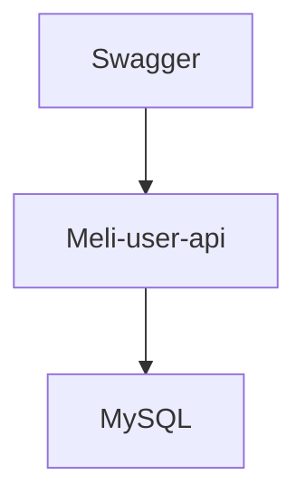

# Meli-user-api
## Descrição

Este projeto visa atender os requisitos solicitados pelo teste do Mercado Livre para atuar como back-end, resumidamente consiste em uma API RestFull em Java/Kotlin com operações de leitura, gravação, atualização e consulta por nome no domínio de usuários.

## Como executar o projeto
#### 1 - Configurando o ambiente

Para executar o processo você precisa de uma série de softwares instalados na sua máquina, abaixo está a lista contendo o necessário e o link de download.
- Requisitos de configurações:
  - Java 21 (Instalado e setado como JAVA_HOME) [Download JDK 21](https://www.oracle.com/br/java/technologies/downloads/)
  - docker [Download docker](https://www.docker.com/products/docker-desktop/)
  - docker-compose [Download docker-compose](https://docs.docker.com/compose/install/)

Para validar se a instalação ocorreu com sucesso use os comandos abaixo no CMD ou Console Bash

Comandos:
- java --version (Deve retornar algo como java 21 LTS, a versão pode mudar
- docker --version (Deve retornar algo como Docker version 24.0.5, a versão pode mudar)
- docker-compose -version (Deve retornar algo como S-jvmci-23.0-b21, a versão pode mudar)

Não se preocupe se os dois últimos números das versões estiverem diferente, [a versão minor e patch](https://semver.org/) pode mudar


#### 2 - Subindo banco de dados com docker-compose
Após realizar o clone do projeto local acesse o diretório da aplicação e execute o comando abaixo.

```
docker-compose up -d
```

Após executar o comando a imagem do MySQL:8 será baixada e o container subirá já criando o banco de dados e suas devidas tabelas.

Para verificar se está tudo ok execute o comando abaixo e verifique se o container ficou UP.

```
docker ps
```
Após executar deve aparecer algo como abaixo:

```
CONTAINER ID   IMAGE       COMMAND                  CREATED         STATUS         PORTS                               NAMES
b7011c664b06   mysql:8.0   "docker-entrypoint.s…"   2 minutes ago   Up 8 seconds   0.0.0.0:3306->3306/tcp, 33060/tcp   mysql-container

```

#### 3 - Executando a aplicação

Acesse o diretório raiz da aplicação e execute  o comando abaixo.

```
./gradlew bootRun
```
Mensagem de sucesso da app subindo
```
main] br.com.mercadolivre.meliuserapi.AppKt    : Started AppKt in 3.664 seconds (process running for 3.855)
```

Para facilitar o teste de vocês eu coloquei o Swagger no projeto, basta acessar a URL abaixo e já aparecerá os acessos as APIs.

## [Swagger com as APIs](http://localhost:8080/swagger-ui/index.html#/)


## Tecnologias utilizadas:

- Linguagem de programação:
  - Kotlin with Java 21
- Frameworks
  - Spring boot 3.X.X
  - Spring data
  - Spring actuator (Health check)
  - Swagger 2.3 (Make tests easy) =)
- Database (RDBMS)
  - MySQL (Version 8.0)
- Containers
  - Docker
  - Docker compose

## Arquitetura macro


## Organizações de pacotes e padrões
Organizei os pacotes segundo a clean architecture, as informações abaixo te ajudarão a entender a organização:

Dicas:
- O pacote boundaries é a fronteira entre o framework e os casos de usos
- Todos os casos de usos dependendem de abstrações, sejam repositories, gateways etc
- Os POJOS de dóminio, DTO e mapeamento objeto relacional (entity) estão separados.
- Cada caso de uso implementa somente uma função o que nos da legibilidade de melhora a manutenibilidade
- Sub pacote impl contem as implementações das abstrações.

## Minhas observações:
- Devido ao final do ano e as demandas corridas não consegui cobrir 100% dos testes mas fiz alguns para vere que sei fazer e entendo a importancia.
- Como nos requisitos não mencionava que era proibido atualizar CPF eu não bloqueie, entendo que em um caso real isso é improvável ser permitido.
- Como é uma aplicação local para teste utilizei o user/senha, root, root mas entendo que em ambiente produtivo precisamos manter esses dados em algum local seguro como um vault e secrets manager.
- Na documentação o requisito diz seguinte "Somente usuários acima de 18 anos serão cadastrados" portanto só será aceito a partir de 19 anos.
- Na documentação diz "Quando buscar por vários usuários, deve permitir realizar um filtro pelo nome", não tinha certeza se era para passar varios nomes e buscar vários users ou passar um nome e buscar vários users, fiz a segunda opção, mas sei fazer a primeira também.
- Incluí health check porém no caso não serve pra nada haha, mas acho importante XD


#### @Author GmsDev04 =)